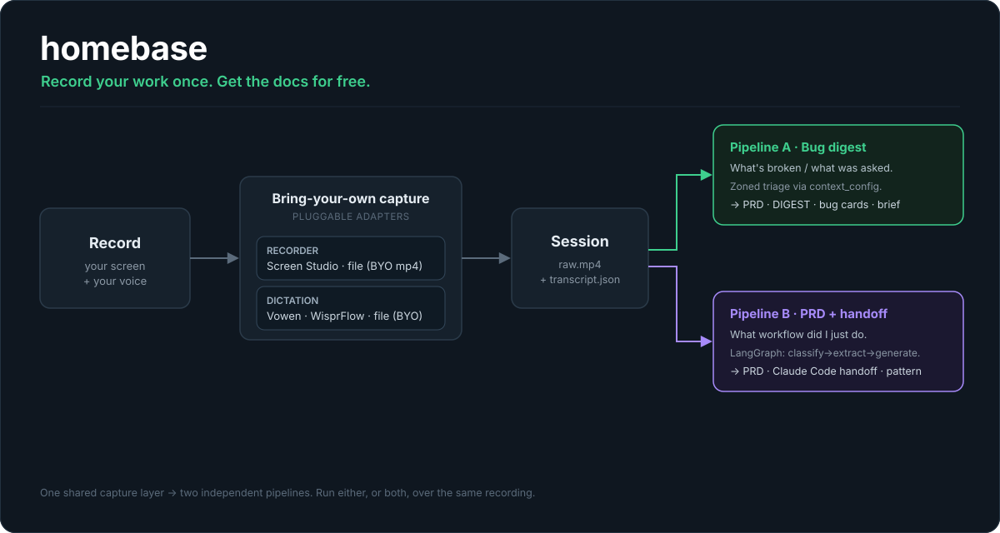
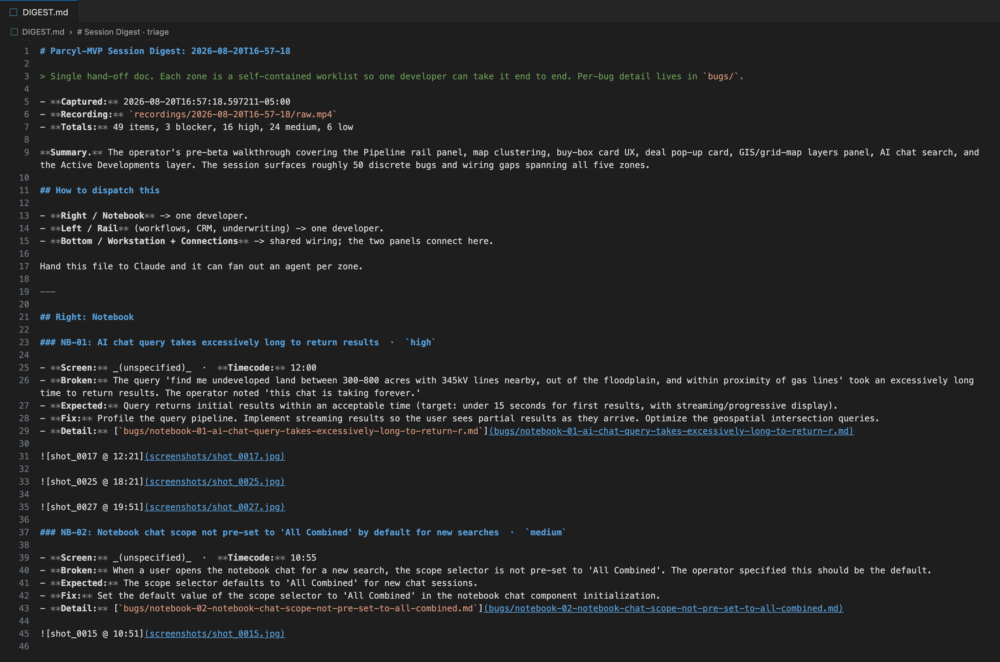
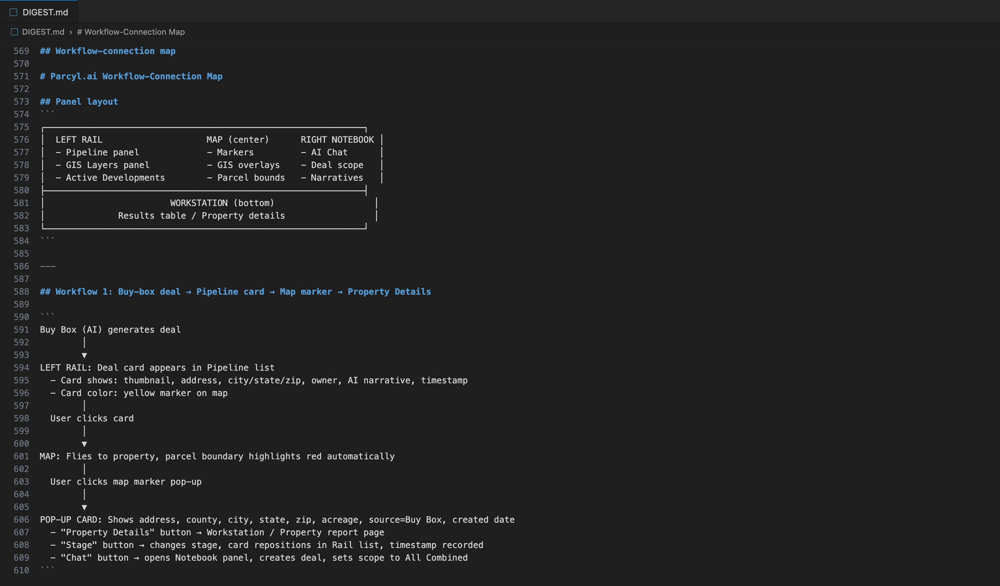
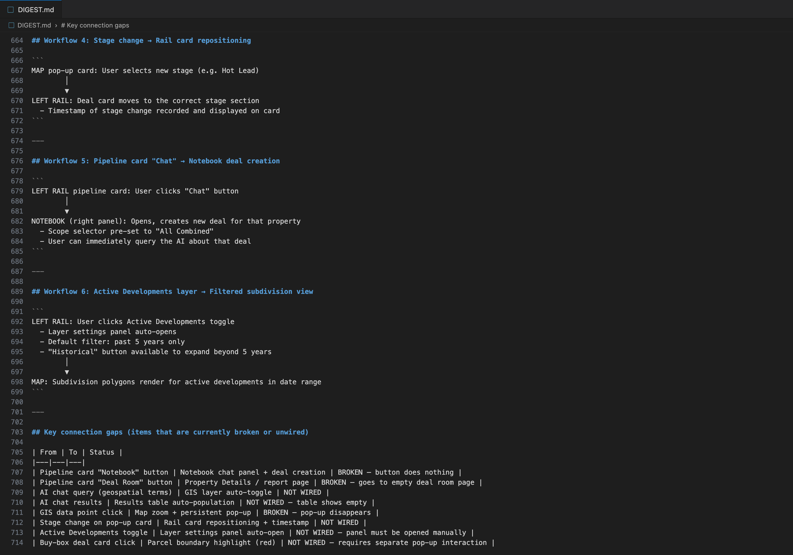

<div align="center">

# homebase

**Build, ship, scale, iterate faster on pure context, captured effortlessly.**

Your work is the richest context there is, and it usually evaporates. homebase captures it as you go and turns it into developer-ready specs, so your whole team moves faster. This is your engine to build and scale more effectively.



</div>

---

## The problem

The most valuable record of how software actually works, and everything wrong with it, happens while someone is *using* it and talking out loud. A QA pass, a walkthrough, a bug bash, a "let me show you what's broken" screen share.

Then it evaporates. Someone has to stop, rewind the recording, and hand-write the bug tickets, the repro steps, the PRD, the handoff. So most of it never gets written down, and the signal is lost.

## What homebase does

homebase turns that recording into the document you would have written by hand, without you writing it.

You record your screen and narrate. homebase watches for the finished session, pulls keyframes from the video, lines them up with your narration, runs it through Claude, and writes the docs to disk. No copy-paste, no transcribing, no "I'll write the ticket later."

**One shared capture layer feeds two independent pipelines.** Point the same recording at whichever answers your question, or run both:

| | Pipeline A: Bug digest | Pipeline B: PRD + handoff |
|---|---|---|
| **Answers** | "What's broken / what was asked for?" | "What workflow did I just do?" |
| **How** | Zoned triage driven by a `context_config` you define, one multimodal Claude pass | A LangGraph reasoning spine: classify, extract, ground, compare, generate |
| **You get** | A prioritized **DIGEST**, a per-bug card with repro + screenshots, a **PRD**, and a **team brief** | A **PRD**, a ready-to-paste **Claude Code handoff prompt**, and a reusable workflow pattern |

## What comes out

Real output from one session. *(Click any image to enlarge and read the detail.)*

### Every bug, triaged and reproducible

One session's `DIGEST.md`: 49 bugs sorted by zone and severity, each with repro steps and a link to the screenshot at its exact timecode.



### See how every screen connects

homebase also reconstructs how your product's panels and screens actually connect, as a clear diagram plus step-by-step flows.



### Catch every broken path

Every broken or unwired connection the walkthrough surfaced, in one table your team can work straight off.



## Bring your own tools

homebase never hard-codes a vendor. Both ends of the capture layer are **pluggable adapters**, chosen in `.env`:

| Seam | Ships with | Default |
|------|------------|---------|
| **Recorder** (`RECORDER`) | `screen-studio`, `file` | `file` (drop in any `.mp4`) |
| **Dictation** (`DICTATION_PROVIDER`) | `vowen`, `wisprflow`, `file` | `file` (drop in any `transcript.json`) |

Use Screen Studio and Vowen, or wire in whatever you already run. A new tool is a new adapter that implements one small interface, not a change to the pipeline. No dictation tool at all? The `file` defaults mean you can hand homebase a recording and a plain transcript and it just works. See [`docs/ARCHITECTURE.md`](docs/ARCHITECTURE.md) for the adapter pattern.

## The outcome

- **The record gets written every time**, because writing it costs nothing.
- **Bugs turn into filed, reproducible tickets** the moment the walkthrough ends.
- **Your stack stays yours.** homebase adapts to your recorder and dictation tool, not the other way around.
- **It runs on your machine.** Your recordings and your API key never leave it.

## Quick start (macOS)

```bash
git clone https://github.com/Parcyl/homebase && cd homebase
cp env.example .env        # add your Anthropic key; pick your recorder + dictation, or keep the file defaults
```

Then record a session, drop the `.mp4` + `transcript.json` in place, and run the pipeline you want. The full walkthrough (prerequisites, choosing adapters, running each pipeline, the menubar app, and the verification gate) is in **[`docs/SETUP.md`](docs/SETUP.md)**.

## How it holds together

- **Pluggable by design.** `TranscriptProvider` and `RecorderAdapter` are the only two seams; everything downstream is tool-agnostic.
- **A configurable brain.** Pipeline A's triage zones and prompt live in a swappable `context_config` (see [`context/example-webapp.json`](context/example-webapp.json)), so it speaks *your* product's structure.
- **Guarded, not hoped.** A dependency-free invariant gate (`evals/run.js`) runs in CI on every change, including a check that no live recording is processed mid-session and that outputs stay clean.

Architecture and the seam pattern: **[`docs/ARCHITECTURE.md`](docs/ARCHITECTURE.md)**.

## Status

Pre-release. macOS-first; Linux and Windows are documented seams, not yet shipped. The WisprFlow adapter is best-effort (its store is SQLite, and the schema is not yet confirmed).

## License

MIT. See [LICENSE](LICENSE). An open-source project from **[Parcyl](https://parcyl.ai)**.
