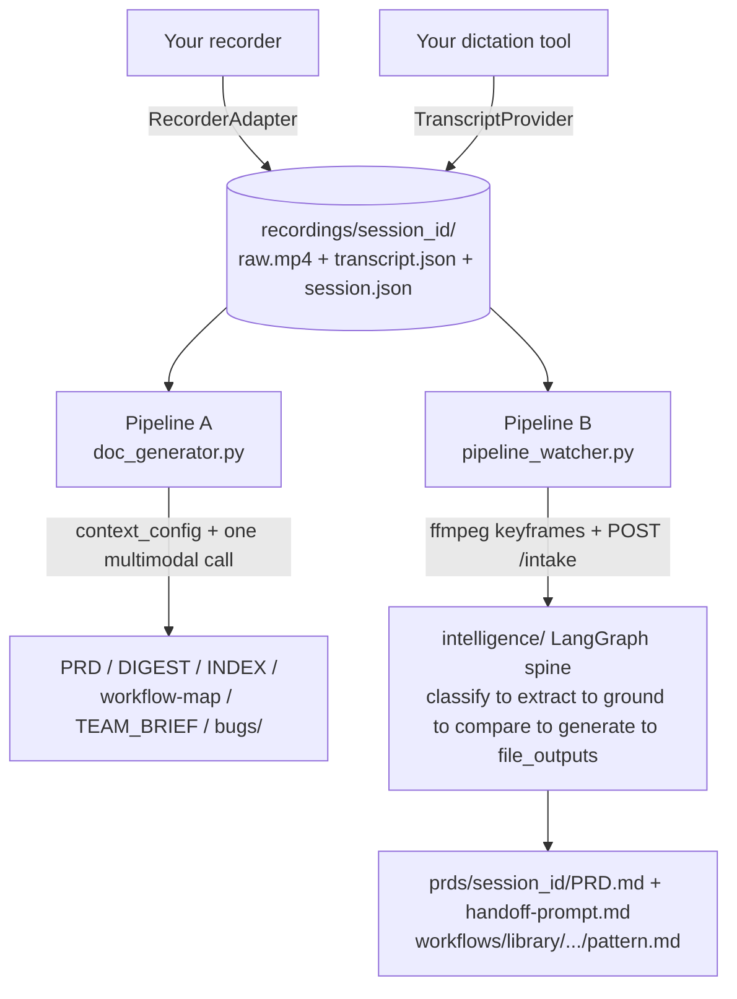

# Architecture

homebase is one **shared capture layer** feeding **two independent analysis pipelines**.
Both pipelines watch the same `recordings/` folder and start from the same session
contract; they differ in what they ask Claude for and what they write back.

```
                    ┌─────────────────────────────────────────┐
                    │              shared capture               │
                    │                                             │
   your recorder ──▶│  RecorderAdapter   (providers/recorder/)  │
 (screen-studio|file)│                                             │
                    │  TranscriptProvider (providers/transcript/)│──▶ recordings/<session_id>/
your dictation tool ▶│   (vowen|wisprflow|file)                   │      raw.mp4
                    │                                             │      transcript.json
                    │  record_session.py  (start / stop / capture)│      session.json
                    │  menubar app (one-click Start/Stop)         │
                    └─────────────────────────────────────────┘
                                        │
                     ┌──────────────────┴──────────────────┐
                     ▼                                       ▼
        Pipeline A, doc_generator.py           Pipeline B, pipeline_watcher.py
        "what's broken / what was asked"        "what workflow did I just do"
                     │                                       │
          context_config (context/*.json)           ffmpeg keyframes
          ffmpeg screenshots + one big              POST /intake
          multimodal Claude call                             │
                     │                                       ▼
                     ▼                          intelligence/ LangGraph spine
        recordings/<session_id>/                 classify → extract → ground →
          PRD.md, DIGEST.md, INDEX.md,            compare → generate → file_outputs
          workflow-map.md, TEAM_BRIEF.md,                    │
          bugs/*.md, screenshots/                            ▼
                                                  prds/<session_id>/PRD.md,
                                                  handoff-prompt.md,
                                                  recordings/<session_id>/workflow-map.md,
                                                  workflows/library/.../pattern.md,
                                                  memory/patterns.md (appended)
```

Mermaid version of the same flow:



Both pipelines poll `recordings/` independently, decide on their own whether a session is
finished, and stamp their own completion marker. Nothing in the design requires running
both, pick the one that answers your question (see the table below), but nothing stops
you running both against the same folder either (`menubar/launchd/README.md` documents
running both watcher services at once). They never call each other.

## 1. Pipeline A vs Pipeline B

| | Pipeline A, `pipeline/doc_generator.py` | Pipeline B, `pipeline/pipeline_watcher.py` + `intelligence/` |
|---|---|---|
| Answers | "What's broken, what did the narrator ask for, zoned and prioritized" | "What workflow did I just do, spec'd well enough for an agent to build it" |
| Driven by | `context/` `context_config` (zones, severities, triage system prompt) | the LangGraph spine (`intelligence/app/graph.py`), no `context_config` involved |
| Calls Claude | once, a large multimodal structured call (the `submit_capture` tool, `doc_generator.py:capture_tool`) | via a FastAPI service (`intelligence/app/main.py`), six sequential graph nodes, each its own Claude call |
| Frames | one screenshot per `SHOT_INTERVAL_S` (15s), capped at `MAX_SHOTS` (48) on disk, `MAX_SHOTS_TO_CLAUDE` (24) sent to the model | a fixed `KEYFRAME_COUNT` (15) evenly-spaced frames, independent of recording length |
| Writes to | `recordings/<session_id>/{PRD.md, DIGEST.md, INDEX.md, workflow-map.md, TEAM_BRIEF.md, bugs/*.md, screenshots/}` | `prds/<session_id>/{PRD.md, handoff-prompt.md}`, `recordings/<session_id>/workflow-map.md`, `workflows/library/<deal_type>/<sub_type>/<intent_slug>/pattern.md`, appends `memory/patterns.md` |
| Run modes | `python3 pipeline/doc_generator.py --session <id> \| --once \| --watch` | `python3 pipeline/pipeline_watcher.py [--once]`, **plus** the intelligence service must be running (`intelligence/run.sh`) for the `/intake` POST to land anywhere |
| launchd label | `com.homebase.docgen.watcher` | `com.homebase.pipeline.watcher` + `com.homebase.intelligence` |

Both read `raw.mp4` + `transcript.json` out of the same `recordings/<session_id>/` and both
defer to `record_session.py`'s `capture` subcommand if the transcript hasn't been written
yet (a dictation tool that flushes its history file a beat late), see
`doc_generator.py:ensure_transcript` and `pipeline_watcher.py:ensure_transcript`, two
separate functions with the same fallback shape, not shared code.

## 2. The shared capture layer

Neither pipeline, nor `record_session.py`, nor the menubar app talks to a specific
recorder or dictation tool by name. Two `typing.Protocol` interfaces sit in between:

### `RecorderAdapter`: `providers/recorder/adapter.py`

```python
class RecorderAdapter(Protocol):
    name: str
    def start(self, session_dir: Path) -> None: ...
    def stop(self, session_dir: Path) -> None: ...
    def resolve_master(self, session_start_epoch: float, session_dir: Path) -> Path | None: ...
```

Shipped adapters (`providers/recorder/__init__.py:get_recorder`, selected by the
`RECORDER` env var):
- `ScreenStudioRecorder` (`screen_studio.py`), `start`/`stop` drive the Screen Studio app
  via AppleScript keystrokes (`screen_studio_start.applescript` / `_stop.applescript`);
  `resolve_master` matches a `~/Documents/Screen Studio/*.screenstudio` bundle against the
  session's start time.
- `FileRecorder` (`file.py`, **default**), `start`/`stop` are no-ops; `resolve_master`
  looks for `raw.mp4` in the session dir, else adopts the largest stray `*.mp4` there (a
  recorder exporting under its own filename, e.g. Screen Studio's `Area.mp4`, still gets
  picked up with no manual rename).

### `TranscriptProvider`: `providers/transcript/provider.py`

```python
class TranscriptProvider(Protocol):
    name: str
    def entries_in_window(self, start_epoch: float, stop_epoch: float | None,
                           tolerance_s: float = 60, grace_s: float = 90) -> list[TranscriptEntry]: ...
    def health(self) -> ProviderHealth: ...
```

Shipped adapters (`providers/transcript/__init__.py:get_provider`, selected by
`DICTATION_PROVIDER`):
- `VowenProvider` (`vowen.py`), reads `~/Library/Application Support/Vowen/transcription-history.json`
  (entries newest-first), windows it to `[start - tolerance_s, stop + grace_s]`. The only
  provider that implements the optional `start()`/`stop()` control (Vowen's Hands-Free Mode,
  via `vowen_start.applescript` / `vowen_stop.applescript`).
- `WisprFlowProvider` (`wisprflow.py`), reads a configured WisprFlow history path.
  **Best-effort**: WisprFlow's on-disk schema wasn't confirmed during the port, so treat
  this adapter as a starting point, not a guarantee.
- `FileProvider` (`file.py`, **default**), reads `<session_dir>/transcript.json`, a JSON
  array of `{"epoch"|"ts", "text"}` (see `context: 3. Session directory contract` below for
  the exact shape). No process, no history file, zero tool assumptions.

`ProviderHealth`/`HealthIssue` (in `provider.py`) distinguish `hard` (blocks starting a
session, checked by `pipeline/capture_healthcheck.py`) from soft/advisory issues, and
`ProviderHealth.last_entry_age_s` is an *artifact* check (age of the newest entry the
provider can see), not a process check, a dictation tool can stay running while its
capture silently freezes, which is exactly what `pipeline/capture_liveness_monitor.py`
watches for during a live recording.

### `record_session.py`, ties both seams to one session

`python3 pipeline/record_session.py start|stop|capture` is what the menubar's Start/Stop
actions (and you, by hand) actually call:
- `start` creates `recordings/<session_id>/`, writes an active-session marker to
  `agents/.rec-session.json`, and remembers `start_epoch`.
- `stop` asks the *configured* `TranscriptProvider` for everything in
  `[start_epoch - tolerance, stop_epoch + grace]`, writes `transcript.json`, and persists
  the fixed window to `session.json` so a later deferred capture (see below) re-applies the
  exact same window rather than guessing from a moving history file.
- `capture` (invoked by the watchers, not by hand) re-runs that same fixed-window query , 
  for a dictation tool that hadn't flushed its entry yet at stop time.

### The menubar app

`menubar/` is a SwiftBar plugin (macOS-only, pure Python/shell, no Xcode). Its Start/Stop
actions (`menubar/actions/start_session.sh` / `stop_session.sh`) drive `record_session.py`
plus the configured `RecorderAdapter`/`TranscriptProvider` through `menubar/lib/state.sh`'s
`recorder_start`/`recorder_stop`/`dictation_start`/`dictation_stop`, never a tool directly.
It also runs the pre-record healthcheck, arms the during-record liveness monitor, and
kicks the independent mic-backup launchd agent (`com.homebase.audiobackup`) so a failed
dictation capture doesn't lose the narration. See `menubar/README.md` and
`menubar/launchd/README.md` for the four optional background services.

## 3. Session directory contract

```
recordings/<session_id>/
  raw.mp4               adopted from whatever *.mp4 lands here, Pipeline A via
                         doc_generator.py:resolve_recording (uses the configured
                         RecorderAdapter.resolve_master), Pipeline B via
                         pipeline_watcher.py:adopt_recording/session_mp4
  transcript.json        [{"epoch": 1782623547.0, "text": "..."}, {"ts": "2026-06-01T20:31:00Z", "text": "..."}]
                         , written by record_session.py, or dropped by hand for
                          DICTATION_PROVIDER=file (see providers/transcript/file.py)
  session.json            {"session_id", "start_epoch", "stop_epoch"}, the fixed narration window
  .processed / .attempts  written by whichever pipeline processed the session
  keyframes/               Pipeline B's ffmpeg output (kf_0001.jpg ...)
  screenshots/              Pipeline A's ffmpeg output + manifest
  PRD.md, DIGEST.md, INDEX.md, workflow-map.md, TEAM_BRIEF.md, bugs/*.md
                            Pipeline A's canonical doc set (written in place, in the session dir)
```

`<session_id>` is always `YYYY-MM-DDTHH-MM-SS[-slug]` (`record_session.py:make_session_id`);
Pipeline B's `/intake` request validates this shape (`intelligence/app/models.py:SESSION_ID_RE`).

Shared repo-root state, written by whichever pipeline/service is running:
- `agents/pipeline-state.json`, the one state contract the menubar reads (documented in
  full in `intelligence/app/pipeline_state.py` and `menubar/README.md`). `pipeline_watcher.py`
  writes it; `doc_generator.py` currently tracks its own `doc-generator-state.json` at the
  repo root instead (see that file's `update_state` docstring), if you run Pipeline A, the
  menubar's stage gauge won't reflect it.
- `inbox/<session_id>.json`, Pipeline B's raw `/intake` response, dropped by
  `pipeline_watcher.py` for downstream consumers.

## 4. `context_config`, Pipeline A only

`doc_generator.py` never hardcodes a product's zones, severities, or triage prompt. All of
that lives in one JSON file, pointed to by `CONTEXT_CONFIG` (default
`context/example-webapp.json`; schema documented in full in `context/schema.md`):

```json
{
  "product_name": "Your Web App",
  "zones": [{"code": "FE", "key": "frontend", "label": "Frontend, UI and client-side behavior"}, ...],
  "severities": ["blocker", "high", "medium", "low"],
  "system_prompt": "You are a senior product engineer triaging ... {product_name} ... {context}",
  "context_md": "context/example-webapp.md"
}
```

- `zones[*].key` is the machine value the model returns and every bug is filed under;
  `code` prefixes bug ids/filenames (`FE-01`); `label` is the rendered heading.
- A bug the model files under an unrecognized zone lands in a built-in catch-all
  (`unclassified` / `UNC`) that always exists on top of your configured zones, not part of
  the config, so a config never has to plan for the model's own deviation.
- `system_prompt` must contain the literal `{product_name}` and `{context}` placeholders;
  `context_md` is a repo-relative markdown file (the ground-truth layout doc) interpolated
  into `{context}` at call time.

Pipeline B's LangGraph nodes (`intelligence/app/nodes/classify.py` etc.) are generic by
design and read no `context_config` at all, the "zones" concept doesn't extend to that
pipeline; it classifies by asset/workflow type instead (see `Classification` in
`intelligence/app/models.py`).

## 5. Adding a new adapter

A new recorder or dictation tool is a new module under `providers/`, never a change to
`pipeline/`, `record_session.py`, or the menubar scripts:

1. Implement the `Protocol` (`RecorderAdapter` in `providers/recorder/adapter.py`, or
   `TranscriptProvider` in `providers/transcript/provider.py`) in a new file, e.g.
   `providers/recorder/obs.py`.
2. Register it in the factory (`providers/recorder/__init__.py:get_recorder` or
   `providers/transcript/__init__.py:get_provider`), add the `elif` branch and the name to
   the `_RECORDERS`/`_PROVIDERS` tuple.
3. Point `RECORDER=obs` / `DICTATION_PROVIDER=obs` at it in `.env`.
4. `TranscriptProvider.start()`/`.stop()` control is optional (only `VowenProvider`
   implements it today), `menubar/lib/state.sh`'s `dictation_start`/`dictation_stop` calls
   it only if the configured provider exposes the method; if yours doesn't, that's a
   correct, silent no-op, matching `FileProvider` and `WisprFlowProvider`.
5. Add unit tests under `providers/recorder/tests/` or `providers/transcript/tests/`, both
   have a `test_*_provider_contract.py` / `test_recorder_provider_contract.py` that already
   asserts every shipped adapter satisfies the Protocol; extend it to cover yours.

## 6. Pipeline B's `/intake` contract

`POST http://127.0.0.1:8080/intake` (`intelligence/app/main.py`, request/response schemas
in `intelligence/app/models.py`):

```json
// request (IntakeRequest)
{
  "session_id": "2026-06-01T20-30-00-slug",
  "recording_path": "recordings/2026-06-01T20-30-00-slug/raw.mp4",
  "transcript": {"...": "provider-native or FileProvider JSON"},
  "keyframe_paths": ["recordings/.../keyframes/kf_0001.jpg", "..."],
  "context_cue": null,
  "target_repo": null
}
```

`target_repo` is optional and unused by `pipeline_watcher.py` today (it always posts
`context_cue: null` and omits `target_repo`); when absent, the `ground` node's existence
claims all stay `to_investigate` rather than asserting anything about a codebase it never
read (`intelligence/app/models.py:Grounding`, `IntegrationStatus`). The response
(`IntakeResponse`) carries `classification`, `outputs` (the four written file paths),
`pattern_match` (new vs. extends an existing library entry), and `low_confidence`.

The FastAPI/LangGraph service described above is real and ported
(`intelligence/app/{main,graph,models,settings,io,pipeline_state}.py` +
`nodes/{classify,extract,grounding,compare,generate,file_outputs}.py`).
